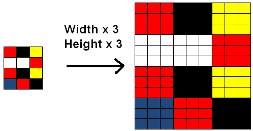

[TOC]

# 第七章_生成对抗网络(GAN)

## 7.1 GAN的「生成」的本质是什么？
GAN的形式是：两个网络，G（Generator）和D（Discriminator）。Generator是一个生成图片的网络，它接收一个随机的噪声z，记做G(z)。Discriminator是一个判别网络，判别一张图片是不是“真实的”。它的输入是x，x代表一张图片，输出D（x）代表x为真实图片的概率，如果为1，就代表100%是真实的图片，而输出为0，就代表不可能是真实的图片。

GAN*生成*能力是*学习分布*，引入的latent variable的noise使习得的概率分布进行偏移。因此在训练GAN的时候，latent variable**不能**引入均匀分布（uniform distribution)，因为均匀分布的数据的引入并不会改变概率分布。

## 7.2 GAN能做数据增广吗？
GAN能够从一个模型引入一个随机数之后「生成」无限的output，用GAN来做数据增广似乎很有吸引力并且是一个极清晰的一个insight。然而，纵观整个GAN的训练过程，Generator习得分布再引入一个Distribution(Gaussian或其他)的噪声以「骗过」Discriminator，并且无论是KL Divergence或是Wasserstein Divergence，本质还是信息衡量的手段（在本章中其余部分介绍），能「骗过」Discriminator的Generator一定是能在引入一个Distribution的噪声的情况下最好的结合已有信息。

训练好的GAN应该能够很好的使用已有的数据的信息（特征或分布），现在问题来了，这些信息本来就包含在数据里面，有必要把信息丢到Generator学习使得的结果加上噪声作为训练模型的输入吗？

## 7.3 VAE与GAN有什么不同？
1. VAE可以直接用在离散型数据。
2. VAE整个训练流程只靠一个假设的loss函数和KL Divergence逼近真实分布。GAN没有假设单个loss函数, 而是让判别器D和生成器G互相博弈，以期得到Nash Equilibrium。

## 7.4 有哪些优秀的GAN？

### 7.4.1 DCGAN

[DCGAN](http://arxiv.org/abs/1511.06434)是GAN较为早期的「生成」效果最好的GAN了，很多人用DCGAN的简单、有效的生成能力做了很多很皮的工作，比如[GAN生成二次元萌妹](https://blog.csdn.net/liuxiao214/article/details/74502975)之类。
关于DCGAN主要集中讨论以下问题：

1. DCGAN的contribution？
2. DCGAN实操上有什么问题？

效果好个人主要认为是引入了卷积并且给了一个非常优雅的结构，DCGAN的Generator和Discriminator几乎是**对称的**，而之后很多研究都遵从了这个对称结构，如此看来学界对这种对称架构有极大的肯定。完全使用了卷积层代替全链接层，没有pooling和upsample。其中upsample是将low resolution到high resolution的方法，而DCGAN用卷积的逆运算来完成low resolution到high resolution的操作，这简单的替换为什么成为提升GAN稳定性的原因？

图中是Upsample的原理图，十分的直观，宛如低分屏换高分屏。然而Upsample和逆卷积最大的不一样是Upsample其实只能放一样的颜色来填充，而逆卷积它是个求值的过程，也就是它要算出一个具体值来，可能是一样的也可能是不一样的——如此，孰优孰劣高下立判。

DCGAN提出了其生成的特征具有向量的计算特性。

[DCGAN Keras实现](https://github.com/jacobgil/keras-dcgan)
### 7.4.2 WGAN/WGAN-GP

WGAN及其延伸是被讨论的最多的部分，原文连发两文，第一篇(Towards principled methods for training generative adversarial networks)非常solid的提了一堆的数学，一作Arjovsky克朗所的数学能力果然一个打十几个。后来给了第二篇Wasserstein GAN，可以说直接给结果了，和第一篇相比，第二篇更加好接受。

然而Wasserstein Divergence真正牛逼的地方在于，几乎对所有的GAN，Wasserstein Divergence可以直接秒掉KL Divergence。那么这个时候就有个问题呼之欲出了：

**KL/JS Divergence为什么不好用？Wasserstein Divergence牛逼在哪里？**

**KL Divergence**是两个概率分布P和Q差别的**非对称性**的度量。KL Divergence是用来度量使用基于Q的编码来编码来自P的样本平均所需的额外的位元数（即分布的平移量）。 而**JS Divergence**是KL Divergence的升级版，解决的是**对称性**的问题。即：JS Divergence是对称的。并且由于KL Divergence不具有很好的对称性，将KL Divergence考虑成距离可能是站不住脚的，并且可以由KL Divergence的公式中看出来，平移量$\to 0$的时候，KL Divergence直接炸了。

KL Divergence:
$$D_{KL}(P||Q)=-\sum_{x\in X}P(x) log\frac{1}{P(x)}+\sum_{x\in X}p(x)log\frac{1}{Q(x)}=\sum_{x\in X}p(x)log\frac{P(x)}{Q(x)}$$

JS Divergence:

$$JS(P_1||P_2)=\frac{1}{2}KL(P_1||\frac{P_1+P_2}{2})$$

**Wasserstein Divergence**：如果两个分配P,Q离得很远，完全没有重叠的时候，KL Divergence毫无意义，而此时JS Divergence值是一个常数。这使得在这个时候，梯度直接消失了。

**WGAN从结果上看，对GAN的改进有哪些？**

1. 判别器最后一层去掉sigmoid
2. 生成器和判别器的loss不取log
3. 对更新后的权重强制截断到一定范围内，比如[-0.01，0.01]，以满足lipschitz连续性条件。
4. 论文中也推荐使用SGD，RMSprop等优化器，不要基于使用动量的优化算法，比如adam。

然而，由于D和G其实是各自有一个loss的，G和D是可以**用不同的优化器**的。个人认为Best Practice是G用SGD或RMSprop，而D用Adam。

很期待未来有专门针对寻找均衡态的优化方法。

**WGAN-GP的改进有哪些？**

**如何理解Wasserstein距离？**
Wasserstein距离与optimal transport有一些关系，并且从数学上想很好的理解需要一定的测度论的知识。

### 7.4.3 condition GAN

### 7.4.4 InfoGAN
通过最大化互信息（c，c’）来生成同类别的样本。

$$L^{infoGAN}_{D,Q}=L^{GAN}_D-\lambda L_1(c,c')$$
$$L^{infoGAN}_{G}=L^{GAN}_G-\lambda L_1(c,c')$$

### 7.4.5 CycleGAN

**CycleGAN与DualGAN之间的区别**

### 7.4.6 StarGAN
目前Image-to-Image Translation做的最好的GAN。

## 7.5 GAN训练有什么难点？
由于GAN的收敛要求**两个网络（D&G）同时达到一个均衡**，

## 7.6 GAN与强化学习中的AC网络有何区别？
强化学习中的AC网络也是Dual Network，似乎从某个角度上理解可以为一个GAN。但是GAN本身

## 7.7 GAN的可创新的点
GAN是一种半监督学习模型，对训练集不需要太多有标签的数据。我认为GAN用在Super Resolution、Inpainting、Image-to-Image Translation（俗称鬼畜变脸）也好，无非是以下三点：

1. 更高效的无监督的利用卷积结构或者结合网络结构的特点对特征进行**复用**。（如Image-to-Image Translation提取特征之后用loss量化特征及其share的信息以完成整个特征复用过程）
2. 一个高效的loss function来**量化变化**。
3. 一个短平快的拟合分布的方法。（如WGAN对GAN的贡献等）

当然还有一些非主流的方案，比如说研究latent space甚至如何优雅的加噪声，这类方案虽然很重要，但是囿于本人想象力及实力不足，难以想到解决方案。

## 7.8 如何训练GAN？
判别器D在GAN训练中是比生成器G更强的网络

Instance Norm比Batch Norm的效果要更好。

使用逆卷积来生成图片会比用全连接层效果好，全连接层会有较多的噪点，逆卷积层效果清晰。

## 7.9 GAN如何解决NLP问题

GAN只适用于连续型数据的生成，对于离散型数据效果不佳，因此假如NLP方法直接应用的是character-wise的方案，Gradient based的GAN是无法将梯度Back propagation（BP）给生成网络的，因此从训练结果上看，GAN中G的表现长期被D压着打。
## 7.10 Reference
### DCGAN部分：
* Radford, A., Metz, L., & Chintala, S. (2015). Unsupervised representation learning with deep convolutional generative adversarial networks. arXiv preprint arXiv:1511.06434.
* Long, J., Shelhamer, E., & Darrell, T. (2015). Fully convolutional networks for semantic segmentation. In Proceedings of the IEEE conference on computer vision and pattern recognition (pp. 3431-3440).
* [可视化卷积操作](https://github.com/vdumoulin/conv_arithmetic)
### WGAN部分：
* Arjovsky, M., & Bottou, L. (2017). Towards principled methods for training generative adversarial networks. arXiv preprint arXiv:1701.04862.
* Arjovsky, M., Chintala, S., & Bottou, L. (2017). Wasserstein gan. arXiv preprint arXiv:1701.07875.
* Nowozin, S., Cseke, B., & Tomioka, R. (2016). f-gan: Training generative neural samplers using variational divergence minimization. In Advances in Neural Information Processing Systems (pp. 271-279).
* Wu, J., Huang, Z., Thoma, J., Acharya, D., & Van Gool, L. (2018, September). Wasserstein Divergence for GANs. In Proceedings of the European Conference on Computer Vision (ECCV) (pp. 653-668).

### CycleGAN
Zhu, J. Y., Park, T., Isola, P., & Efros, A. A. (2017). Unpaired image-to-image translation using cycle-consistent adversarial networks. arXiv preprint.
