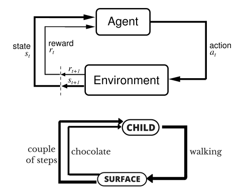
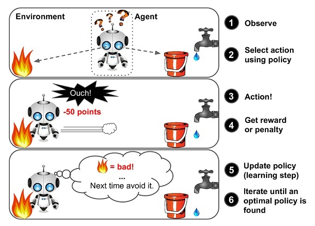

[TOC]

# 第十章 强化学习

## 10.1强化学习的主要特点？
其他许多机器学习算法中学习器都是学得怎样做，而RL是在尝试的过程中学习到在特定的情境下选择哪种行动可以得到最大的回报。在很多场景中，当前的行动不仅会影响当前的rewards，还会影响之后的状态和一系列的rewards。RL最重要的3个特定在于：
(1)	基本是以一种闭环的形式；
(2)	不会直接指示选择哪种行动（actions）；
(3)	一系列的actions和奖励信号（reward signals）都会影响之后较长的时间。 

### 1. 定义
强化学习是机器学习的一个重要分支，是多学科多领域交叉的一个产物，它的本质是解决 decision making 问题，即自动进行决策，并且可以做连续决策。
它主要包含四个元素，agent，环境状态，行动，奖励, 强化学习的目标就是获得最多的累计奖励。
我们列举几个形象的例子：
小孩想要走路，但在这之前，他需要先站起来，站起来之后还要保持平衡，接下来还要先迈出一条腿，是左腿还是右腿，迈出一步后还要迈出下一步。
小孩就是 agent，他试图通过采取行动（即行走）来操纵环境（行走的表面），并且从一个状态转变到另一个状态（即他走的每一步），当他完成任务的子任务（即走了几步）时，孩子得到奖励（给巧克力吃），并且当他不能走路时，就不会给巧克力。

上图中agent代表自身，如果是自动驾驶，agent就是车；如果你玩游戏它就是你当前控制的游戏角色，如马里奥，马里奥往前走时环境就一直在发生变化，有小怪物或者障碍物出现，它需要通过跳跃来进行躲避，就是要做action（如向前走和跳起的动作）；无人驾驶的action就是车左转、右转或刹车等等，它无时无刻都在与环境产生交互，action会反馈给环境，进而改变环境，如果自动驾驶的车行驶目标是100米，它向前开了10米，那环境就发生了变化，所以每次产生action都会导致环境改变，环境的改变会反馈给自身（agent），就是这样的一个循环；反馈又两种方式：1、做的好（reward）即正反馈，2、做得不好（punishment惩罚）即负反馈。Agent可能做得好，也可能做的不好，环境始终都会给它反馈，agent会尽量去做对自身有利的决策，通过反反复复这样的一个循环，agent会越来越做的好，就像孩子在成长过程中会逐渐明辨是非，这就是强化学习。
## 10.2强化学习应用实例
（1）Manufacturing

例如一家日本公司 Fanuc，工厂机器人在拿起一个物体时，会捕捉这个过程的视频，记住它每次操作的行动，操作成功还是失败了，积累经验，下一次可以更快更准地采取行动。

（2）Inventory Management

在库存管理中，因为库存量大，库存需求波动较大，库存补货速度缓慢等阻碍使得管理是个比较难的问题，可以通过建立强化学习算法来减少库存周转时间，提高空间利用率。

（3）Dynamic pricing

强化学习中的 Q-learning 可以用来处理动态定价问题。

（4）Customer Delivery

制造商在向各个客户运输时，想要在满足客户的所有需求的同时降低车队总成本。通过 multi-agents 系统和 Q-learning，可以降低时间，减少车辆数量。

（5）ECommerce Personalization

在电商中，也可以用强化学习算法来学习和分析顾客行为，定制产品和服务以满足客户的个性化需求。
（6）Ad Serving

例如算法 LinUCB （属于强化学习算法 bandit 的一种算法），会尝试投放更广范围的广告，尽管过去还没有被浏览很多，能够更好地估计真实的点击率。
再如双 11 推荐场景中，阿里巴巴使用了深度强化学习与自适应在线学习，通过持续机器学习和模型优化建立决策引擎，对海量用户行为以及百亿级商品特征进行实时分析，帮助每一个用户迅速发现宝贝，提高人和商品的配对效率。还有，利用强化学习将手机用户点击率提升了 10-20%。

（7）Financial Investment Decisions

例如这家公司 Pit.ai，应用强化学习来评价交易策略，可以帮助用户建立交易策略，并帮助他们实现其投资目标。

（8）Medical Industry

动态治疗方案（DTR）是医学研究的一个主题，是为了给患者找到有效的治疗方法。 例如癌症这种需要长期施药的治疗，强化学习算法可以将患者的各种临床指标作为输入 来制定治疗策略。
## 10.3强化学习和监督式学习、非监督式学习的区别
在机器学习中，我们比较熟知的是监督式学习，非监督学习，此外还有一个大类就是强化学习：
当前的机器学习算法可以分为3种：有监督的学习（Supervised Learning）、无监督的学习（Unsupervised Learning）和强化学习（Reinforcement Learning），结构图如下所示：

 

### 强化学习和监督式学习的区别：
监督式学习就好比你在学习的时候，有一个导师在旁边指点，他知道怎么是对的怎么是错的，但在很多实际问题中，例如 chess，go，这种有成千上万种组合方式的情况，不可能有一个导师知道所有可能的结果。

而这时，强化学习会在没有任何标签的情况下，通过先尝试做出一些行为得到一个结果，通过这个结果是对还是错的反馈，调整之前的行为，就这样不断的调整，算法能够学习到在什么样的情况下选择什么样的行为可以得到最好的结果。

就好比你有一只还没有训练好的小狗，每当它把屋子弄乱后，就减少美味食物的数量（惩罚），每次表现不错时，就加倍美味食物的数量（奖励），那么小狗最终会学到一个知识，就是把客厅弄乱是不好的行为。

两种学习方式都会学习出输入到输出的一个映射，监督式学习出的是之间的关系，可以告诉算法什么样的输入对应着什么样的输出，强化学习出的是给机器的反馈 reward function，即用来判断这个行为是好是坏。
另外强化学习的结果反馈有延时，有时候可能需要走了很多步以后才知道以前的某一步的选择是好还是坏，而监督学习做了比较坏的选择会立刻反馈给算法。

而且强化学习面对的输入总是在变化，每当算法做出一个行为，它影响下一次决策的输入，而监督学习的输入是独立同分布的。

通过强化学习，一个 agent 可以在探索和开发（exploration and exploitation）之间做权衡，并且选择一个最大的回报。 

exploration 会尝试很多不同的事情，看它们是否比以前尝试过的更好。 

exploitation 会尝试过去经验中最有效的行为。

一般的监督学习算法不考虑这种平衡，就只是是 exploitative。

### 强化学习和非监督式学习的区别：

非监督式不是学习输入到输出的映射，而是模式。例如在向用户推荐新闻文章的任务中，非监督式会找到用户先前已经阅读过类似的文章并向他们推荐其一，而强化学习将通过向用户先推荐少量的新闻，并不断获得来自用户的反馈，最后构建用户可能会喜欢的文章的“知识图”。

对非监督学习来说，它通过对没有概念标记的训练例进行学习，以发现训练例中隐藏的结构性知识。这里的训练例的概念标记是不知道的，因此训练样本的歧义性最高。对强化学习来说，它通过对没有概念标记、但与一个延迟奖赏或效用（可视为延迟的概念标记）相关联的训练例进行学习，以获得某种从状态到行动的映射。这里本来没有概念标记的概
念，但延迟奖赏可被视为一种延迟概念标记，因此其训练样本的歧义性介于监督学习和非监督学习之间。

需要注意的是，监督学习和非监督学习从一开始就是相对的，而强化学习在提出时并没有从训练样本歧义性的角度考虑其与监督学习和非监督学习的区别，因此，一些早期的研究中把强化学习视为一种特殊的非监督学习。事实上，对强化学习的定位到目前仍然是有争议的，有的学者甚至认为它是与“从例子中学习”同一级别的概念。

从训练样本歧义性角度进行的分类体系，在近几年可望有一些扩展，例如多示例学习（multi-instancelearning）等从训练样本歧义性方面来看很特殊的新的学习框架有可能会进入该体系。但到目前为止，没有任何新的框架得到了公认的地位。另外，半监督学习（semi-supervisedlearning）也有一定希望，它的障碍是半监督学习中的歧义性并不是与生俱来的，而是人为的，即用户期望用未标记的样本来辅助对已标记样本的学习。这与监督学习、非监督学习、强化学习等天生的歧义性完全不同。半监督学习中人为的歧义性在解决工程问题上是需要的、有用的（对大量样本进行标记的代价可能是极为昂贵的），但可能不太会导致方法学或对学习问题视点的大的改变。

**强化学习和前二者的本质区别**:没有前两者具有的明确数据概念，它不知道结果，只有目标。数据概念就是大量的数据，有监督学习、无监督学习需要大量数据去训练优化你建立的模型，就像猫狗识别，用n多张猫狗图片去训练模型，经过训练优化后，你用一张崭新的猫狗图片让模型作出判断，这个模型就知道是猫还是狗。
## 10.4 强化学习主要有哪些算法？
强化学习不需要监督信号,可以在模型未知的环境中平衡探索和利用, 其主要算法有蒙特卡罗强化学习, 时间差分(temporal difference: TD)学习, 策略梯度等。典型的深度强化学习算法特点及性能比较如下图所示：

除了上述深度强化学习算法，还有深度迁移强化学习、分层深度强化学习、深度记忆强化学习以及多智能体强化学习等算法。
## 10.5深度迁移强化学习算法 
传统深度强化学习算法每次只能解决一种游戏任务, 无法在一次训练中完成多种任务. 迁移学习和强化学习的结合也是深度强化学习的一种主要思路。

Parisotto等提出了一种基于行为模拟的深度迁移强化学习算法. 该算法通过监督信号的指导, 使得单一的策略网络学习各自的策略, 并将知识迁移到新任务中. Rusa等提出策略蒸馏(policy distillation)深度迁移强化学习算法. 策略蒸馏算法中分为学习网络和指导网络, 通过这两个网络Q值的偏差来确定目标函数,引导学习网络逼近指导网络的值函数空间. 此后,Rusa等又提出了一种基于渐进神经网络(progressive neural networks, PNN)的深度迁移强化学习算法.PNN是一种把神经网络和神经网络连起来的算法. 它在一系列序列任务中, 通过渐进的方式来存储知识和提取特征, 完成了对知识的迁移. PNN最终实现多个独立任务的训练, 通过迁移加速学习过程, 避免灾难性遗忘. Fernando 等提出了路径网络(PathNet)[45].PathNet可以说是PNN的进阶版. PathNet把网络中每一层都看作一个模块, 把构建一个网络看成搭积木,也就是复用积木. 它跟PNN非常类似, 只是这里不再有列, 而是不同的路径. 	PathNet将智能体嵌入到神经网络中, 其中智能体的任务是为新任务发现网络中可以复用的部分. 智能体是网络之中的路径, 其决定了反向传播过程中被使用和更新的参数范围. 在一系列的Atari强化学习任务上, PathNet都实现了正迁移, 这表明PathNet在训练神经网络上具有通用性应用能力.PathNet也可以显著提高A3C算法超参数选择的鲁棒性. Schaul等提出了一种通用值函数逼近器(universalvalue function approximators, UVFAs)来泛化状态和目标空间．UVFAs可以将学习到的知识迁移到环境动态特性相同但目标不同的新任务中.
## 10.6分层深度强化学习算法 
分层强化学习可以将最终目标分解为多个子任务来学习层次化的策略, 并通过组合多个子任务的策略形成有效的全局策略. Kulkarni等提出了分层DQN(hierarchical deep Q-network, h--DQN) 算法. h--DQN基于时空抽象和内在激励分层, 通过在不同的时空尺度上设置子目标对值函数进行层次化处理. 顶层的值函数用于确定宏观决策, 底层的值函数用于确定具体行动．Krishnamurthy等在h--DQN的基础上提出了基于内部选择的分层深度强化学习算法. 该模型结合时空抽象和深度神经网络, 自动地完成子目标的学习, 避免了特定的内在激励和人工设定中间目标,加速了智能体的学习进程, 同时也增强了模型的泛化能力. Kulkarni等基于后续状态表示法提出了深度后续强化学习(deep successor reinforcement learning,DSRL)．DSRL通过阶段性地分解子目标和学习子目标策略, 增强了对未知状态空间的探索, 使得智能体更加适应那些存在延迟反馈的任务．Vezhnevets等受封建(feudal)强化学习算法的启发, 提出一种分层深度强化学习的架构FeUdal网络(FuNs)[49]. FuNs框架使用一个管理员模块和一个工人模块. 管理员模块在较低的时间分辨率下工作, 设置抽象目标并传递给工人模块去执行. FuNs框架创造了一个稳定的自然层次结构, 并且允许两个模块以互补的方式学习. 实验证明, FuNs有助于处理长期信用分配和记忆任务,在Atari视频游戏和迷宫游戏中都取得了不错的效果。
## 10.7深度记忆强化学习算法 
传统的深度强化学习模型不具备记忆、认知、推理等高层次的能力, 尤其是在面对状态部分可观察和延迟奖赏的情形时. Junhyuk等通过在传统的深度强化学习模型中加入外部的记忆网络部件和反馈控制机制, 提出反馈递归记忆Q网络(feedback recurrent memory Q-network, FRMQN)). FRMQN模型具备了一定的记忆与推理功能, 通过反馈控制机制,FRMQN整合过去存储的有价值的记忆和当前时刻的上下文状态, 评估动作值函数并做出决策. FRMQN初步模拟了人类的主动认知与推理能力, 并完成了一些高层次的认知任务. 在一些未经过训练的任务中,FRMQN模型表现出了很强的泛化能力．Blundell等设计出一种模型无关的情节控制算法(model-free episode control, MFEC). MFEC可以快速存储和回放状态转移序列, 并将回放的序列整合到结构化知识系统中, 使得智能体在面对一些复杂的决策任务时, 能快速达到人类玩家的水平．MFEC通过反向经验回放, 使智能体拥有初步的情节记忆. 实验表明, 基于MFEC算法的深度强化学习不仅可以在Atari游戏中学习到有效策略, 还可以处理一些三维场景的复杂任务. Pritzel等在MFEC的基础上进一步提出了神经情节控制(neural episodic control, NEC),有效提高了深度强化学习智能体的记忆能力和学习效率[53]. NEC能快速吸收新经验并依据新经验来采取行动. 价值函数包括价值函数渐变状态表示和价值函数快速更新估计两部分. 大量场景下的研究表明,NEC的学习速度明显快于目前最先进的通用深度强化学习智能体.
## 10.8 多智能体深度强化学习算法
在一些复杂场景中, 涉及到多智能体的感知决策问题, 这时需要将单一模型扩展为多个智能体之间相互合作、通信及竞争的多智能体深度强化学习系统.Foerster等提出了一种称为分布式深度递归Q网络(deep distributed recurrent Q-networks, DDRQN) 的模型, 解决了状态部分可观测状态下的多智能体通信与合作的挑战性难题[54]. 实验表明, 经过训练的DDRQN模型最终在多智能体之间达成了一致的通信协1536 控制理论与应用第34 卷议, 成功解决了经典的红蓝帽子问题.让智能体学会合作与竞争一直以来都是人工智能领域内的一项重要研究课题, 也是实现通用人工智能的必要条件. Lowe等提出了一种用于合作–竞争混合环境的多智能体actor-critic 算法(multi-agent deepdeterministic policy gradient, MADDPG)[55]. MADDPG对DDPG强化学习算法进行了延伸, 可实现多智能体的集中式学习和分布式执行, 让智能体学习彼此合作和竞争. 在多项测试任务中, MADDPG的表现都优于DDPG. 
## 10.9强化学习开源框架
谷歌TensorFlow Agents ---TensorFlow的加强版,它提供许多工具，通过强化学习可以实现各类智能应用程序的构建与训练。这个框架能够将OpoenAI Gym接口扩展至多个并行环境，并允许各代理立足TensorFlow之内实现以执行批量计算。其面向OpoenAI Gy环境的批量化接口可与TensorFlow实现全面集成，从而高效执行各类算法。该框架还结合有BatchPPO，一套经过优化的近端策略优化算法实现方案。其核心组件包括一个环境打包器，用于在外部过程中构建OpenAI Gym环境; 一套批量集成，用于实现TensorFlow图步并以强化学习运算的方式重置函数; 外加用于将TensorFlow图形批处理流程与强化学习算法纳入训练特内单一却步的组件。

Roboschool：Roboschool 提供开源软件以通过强化学习构建并训练机器人模拟。其有助于在同一环境当中对多个代理进行强化学习训练。通过多方训练机制，您可以训练同一代理分别作为两方玩家（因此能够自我对抗）、使用相同算法训练两套代理，或者设置两种算法进行彼此对抗。Roboschool由OpenAI开发完成，这一非营利性组织的背后赞助者包括Elon Musk、Sam Altman、Reid Hoffman以及Peter Thiel。其与OpenAI Gym相集成，后者是一套用于开发及评估强化学习算法的开源工具集。OpenAI Gym与TensorFlow、Theano以及其它多种深度学习库相兼容。OpenAI Gym当中包含用于数值计算、游戏以及物理引擎的相关代码。Roboschool基于Bullet物理引擎，这是一套开源许可物理库，并被其它多种仿真软件——例如Gazebo与Virtual Robot Experimentation Platform（简称V-REP）所广泛使用。其中包含多种强化学习算法，具体以怨报德 异步深度强化学习方法、Actor-Critic with Experience Replay、Actor- Critic using Kronecker-Factored Trust Region、深度确定性策略梯度、近端策略优化以及信任域策略优化等等。

Coach：英特尔公司的开源强化学习框架，可以对游戏、机器人以及其它基于代理的智能应用进行智能代理的建模、训练与评估。Coach 提供一套模块化沙箱、可复用组件以及用于组合新强化学习算法并在多种应用领域内训练新智能应用的Python API。该框架利用OpenAI Gym作为主工具，负责与不同强化学习环境进行交换。其还支持其它外部扩展，具体包括Roboschool、gym-extensions、PyBullet以及ViZDoom。Coach的环境打包器允许用户向其中添加自定义强化学习环境，从而解决其它学习问题。该框架能够在桌面计算机上高效训练强化学习代理，并利用多核CPU处理相关任务。其能够为一部分强化学习算法提供单线程与多线程实现能力，包括异步优势Actor-Critic、深度确定性策略梯度、近端策略优化、直接未来预测以及规范化优势函数。所有算法皆利用面向英特尔系统作出优化的TensorFLow完成，其中部分算法亦适用于英特尔的Neon深度学习框架。Coach 当中包含多种强化学习代理实现方案，具体包括从单线程实现到多线程实现的转换。其能够开发出支持单与多工作程序（同步或异步）强化学习实现方法的新代理。此外，其还支持连续与离散操作空间，以及视觉观察空间或仅包含原始测量指标的观察空间。
## 10.10深度强化学习算法小结
基于值函数概念的DQN及其相应的扩展算法在离散状态、离散动作的控制任务中已经表现了卓越的性能, 但是受限于值函数离散型输出的影响, 在连续型控制任务上显得捉襟见肘. 基于策略梯度概念的,以DDPG, TRPO等为代表的策略型深度强化学习算法则更适用于处理基于连续状态空间的连续动作的控制输出任务, 并且算法在稳定性和可靠性上具有一定的理论保证, 理论完备性较强. 采用actor-critic架构的A3C算法及其扩展算法, 相比于传统DQN算法, 这类算法的数据利用效率更高, 学习速率更快, 通用性、可扩展应用性更强, 达到的表现性能更优, 但算法的稳定性无法得到保证. 而其他的如深度迁移强化学习、分层深度强化学习、深度记忆强化学习和多智能体深度强化学习等算法都是现在的研究热点, 通过这些算法能应对更为复杂的场景问题、系统环境及控制任务, 是目前深度强化学习算法研究的前沿领域.

展望未来，人工智能开发者们需要尽可能掌握上述框架以及其中所使用的各类强化学习算法。此外，还需要强化自身对于多代理强化学习架构的理解，因为其中多种框架都大量利用前沿博弈论研究成果。最后，还需要熟悉深度强化学习知识。

